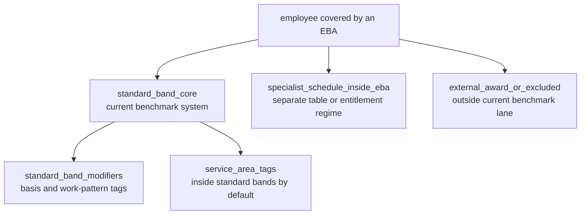

# Cohort Reference Model

Status: draft reference scaffold as of 2026-05-03.

This folder captures the project rule that the current pay-table benchmark system is the `standard_band_core`. That core is the anchor for cohort decisions, entitlement extraction, and future knowledge-base growth.

The important distinction is:

> Cohorts describe how an employee group behaves in the EBA workflow. Awards and instruments describe where the legal or industrial source may come from. Do not create a new cohort category just because another award can be linked to the work.

## Anchor Concept

`standard_band_core` means ordinary numeric Band/Level matrices, usually Band 1-10 with ordinary levels such as A-D or 1-4. These are the rows the current scenario and governed pay-table system is designed to benchmark.

## Decision Rule

If it resolves to the ordinary Band/Level matrix, keep it in `standard_band_core`.

If it needs its own progression, pay table, award logic, hourly-only structure, professional schedule, or materially different entitlement regime, move it out of the core and classify it as a candidate specialist or excluded cohort.

If it is only an occupation, department, work area, or clause label inside the same Band/Level matrix, keep it as a tag. Do not promote it to a cohort category unless the agreement evidence proves the treatment is materially different.

## Category Pressure

The scaffold should balance two pressures:

- too few categories hides real differences in rates and entitlements;
- too many categories turns every occupation name into a false cohort.

Use this promotion path:

1. `alias`: alternative language for the same concept.
2. `tag`: useful descriptor that does not split the benchmark cohort.
3. `candidate_subcohort`: repeated evidence suggests possible distinct treatment.
4. `supported_subcohort`: distinct treatment is proven across enough agreements.
5. `primary_cohort`: material enough to become its own workflow lane.

## Current Files

- `cohort-nomenclature.yaml`: machine-readable draft scaffold for the anchor, tags, modifiers, and non-core categories.

Future code should load this reference rather than expanding hard-coded keyword lists, but the first purpose is conceptual governance: every entitlement or pay-table change should name whether it touches `standard_band_core`, a modifier/tag, or a non-core cohort.
